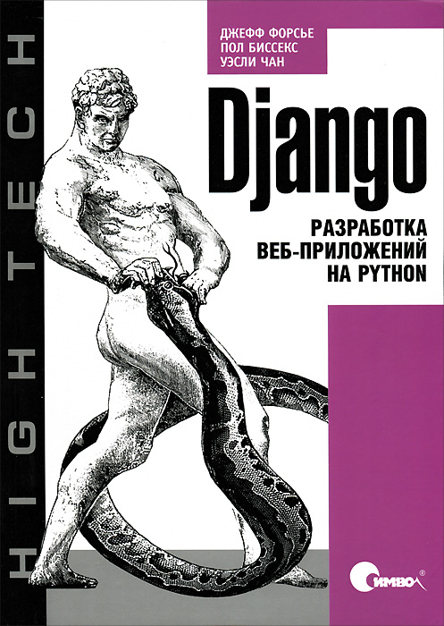

# Code Examples from 'Python Web Development with Django' book
### About book
#### Python Web Development with Django (Jeff Forcier, Paul Bissex, Wesley Chun)
Using the simple, robust, Python-based Django framework, you can build powerful Web solutions 
with remarkably few lines of code. In Python Web Development with Django®, three experienced 
Django and Python developers cover all the techniques, tools, and concepts you need to make 
the most of Django 1.0, including all the major features of the new release.
##### [Link on book](https://www.amazon.com/Python-Development-Django-Jeff-Forcier/dp/0132356139)
## Projects
#### Projects use Django version 3, but in book examples with ver. 1.0
- [Gallary](gallery)
- [Cmsproject](cmsproject)
- [Liveproject](liveproject)
- [Pastebin](pastebin)
# Fun Fact
##### How you think, what men on book cover doing with a snake?

### YAS, he learns him!